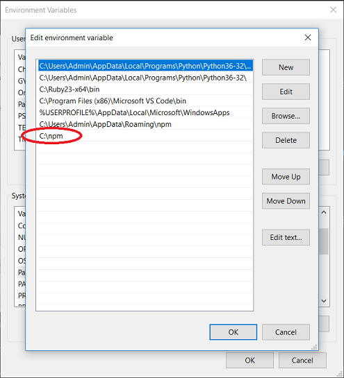
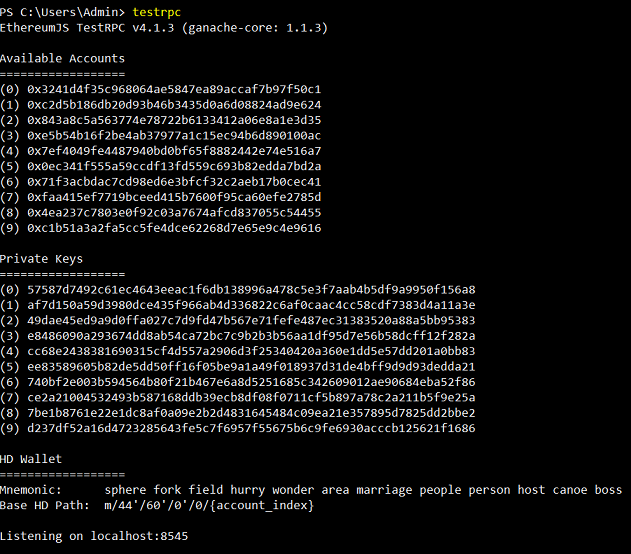

# Ethereum Smart Contract Development Environment for Windows

A comprehensive guide for setting up your Windows 64bit workstation to begin developing, building and testing Smart Contracts.

## Requirements
In order to begin development you will need the following;

* Visual Studio Code: https://code.visualstudio.com/ 
* The Solidity extension installed for Visual Studio Code
* OpenSSL Win64 libraries which can be downloaded here; https://slproweb.com/products/Win32OpenSSL.html
* Git Shell or Git Bash https://git-for-windows.github.io/ 

### Helpful Links
* The online Solidity compiler: https://ethereum.github.io/browser-solidity
* Truffle Documentation: http://truffleframework.com/docs/ 

## Setup Instructions
1. Clone this repository to your machine
2. Open Powershell and navigate to the directory of the cloned repo then execute the following;
```
powershell .\Install-Truffle.ps1 
```
This will download & install the latest version of **Node.JS** and the required npm modules for Ethereum development; **TestRPC** & **Truffle**.

3. Upon successful execution of the powershell script,ensure the path ```C:\npm``` is an entry in the User's environment variables;



4. Restart your terminal console (GitShell/GitBash/Powershell etc)

5. To confirm the components were installed and configured correctly type ```truffle version``` in the terminal prompt and hit enter. This should return output similiar to this;
```
Truffle v3.4.11 (core: 3.4.11)
Solidity v0.4.15 (solc-js)
```
6. Congratulations - You are now ready to build your first Ethereum Smart Contract.

## Smart Contract Development Workflow
Truffle with TestRPC provides us with an **Ethereum network simulator** which is fast, free and private. Ideally, you will want to confirm your contract is bug free and meets it's requirements before deploying it to the ```testnet``` which is still free however public and up for scrutiny. Once satisfied and ready to execute the contract in the **live(the real)** Ethereum network, we will deploy to the ```mainnet```.

### Let's Start
In the ```Essentials``` directory you should see a folder structure like this;

```
.
├── contracts
│   ├── ConvertLib.sol
│   ├── HelloWorld.sol
│   ├── MetaCoin.sol
│   └── Migrations.sol
├── migrations
│   ├── 1_initial_migration.js
│   └── 2_deploy_contracts.js
├── test
│   └── metacoin.js
└── truffle.js
```

This is the result of executing ```truffle init``` inside of this directory. Truffle will create all the files for an example project, including contracts for ```MetaCoin```, a sample token contract. You should now start by creating your own contract in a different folder, executing ```truffle init``` in that folder's root.

Run ```testrpc``` in a new terminal and leave it running while you develop. Each time you run testrpc, it will generate 10 new addresses with simulated test funds for you to use. **IMPORTANT** Ensure you have no other services listening or forwarded to the RPC port which is 8545.



Let that terminal window stay open while navigating to the root of YOUR contracts folder in a **new** console.

You should be able to compile the example contracts by running ```truffle compile```. 

Then, to deploy the contracts to the simulated network. We need to first modify the ```\migrations\2_deploy_contracts.js``` file to instruct truffle the contract(s) to deploy to our local development network (see the example in the Essentials folder).

Once that is done, you need to run ```truffle migrate```:

```
> truffle migrate
Using network 'development'.

Running migration: 1_initial_migration.js
  Deploying Migrations...
  ... 0x8f0ce73af488018dd718aa8c749defe93523bd7923bbfefb8dbe9dedc06bdbeb
  Migrations: 0x1afd4f4bc46017861c221869e18da61ff8470691
Saving successful migration to network...
  ... 0x24ce548bb17c17ce6f5ac0f77eebff9d046eae08642ffa9aa83d4fc704e53736
Saving artifacts...
Running migration: 2_deploy_contracts.js
  Deploying HelloWorld...
  ... 0x6dddcb9c6693aa019fa379e782f53544dee666c890367867488e16968dea8ae5
  HelloWorld: 0xcf25e0ad79727b0f0312bb6b3a457480fbe1707d
Saving successful migration to network...
  ... 0xb28e0ddb6d74553e42e9f32c103e9d1ed093683c5c328ad715a7fb0e45de4508
Saving artifacts...
```

### Let's Advance
Now we have deployed our contract its time to play with it. We can use ```truffle console``` to send messages to the contract and read its public state.

```
truffle(development)> HelloWorld.deployed()
```
Using .deployed() in-built function we're able to see the state and contracts properties

```
// get the deployed version of our contract
truffle(development)> var helloworld = HelloWorld.at(HelloWorld.address)
//or better yet;
truffle(development)> HelloWorld.deployed().then(function(instance){helloworld=instance})

// and print its address
truffle(development)> helloworld.address
'0xcf25e0ad79727b0f0312bb6b3a457480fbe1707d'
```

After making any changes to the contract(s) run ```truffle compile``` and then ```truffle migrate --reset```

```
truffle(development)> var accounts = web3.eth.accounts
truffle(development)> accounts
[ '0x3241d4f35c968064ae5847ea89accaf7b97f50c1',
  '0xc2d5b186db20d93b46b3435d0a6d08824ad9e624',
  '0x843a8c5a563774e78722b6133412a06e8a1e3d35',
  '0xe5b54b16f2be4ab37977a1c15ec94b6d890100ac',
  '0x7ef4049fe4487940bd0bf65f8882442e74e516a7',
  '0x0ec341f555a59ccdf13fd559c693b82edda7bd2a',
  '0x71f3acbdac7cd98ed6e3bfcf32c2aeb17b0cec41',
  '0xfaa415ef7719bceed415b7600f95ca60efe2785d',
  '0x4ea237c7803e0f92c03a7674afcd837055c54455',
  '0xc1b51a3a2fa5cc5fe4dce62268d7e65e9c4e9616' ]
```

Now lets make a deposit on our HelloWorld smart contract
```
truffle(development)> helloworld.deposit(400)
{ tx: '0x80d0e5a01f494b0b02b4b1ba87e0725f7508f36597343e82adf1361c6265f22c',                 
  receipt:                                                                                  
   { transactionHash: '0x80d0e5a01f494b0b02b4b1ba87e0725f7508f36597343e82adf1361c6265f22c', 
     transactionIndex: 0,                                                                   
     blockHash: '0xcbd420c16488b57aed953691c4cb07281ba793c3daffe3d0a6b1c67eb28c7fd1',       
     blockNumber: 14,                                                                       
     gasUsed: 26932,                                                                        
     cumulativeGasUsed: 26932,                                                              
     contractAddress: null,                                                                 
     logs: [] },                                                                            
  logs: [] } 
  ```

  This returns the ```tx``` which is the Transaction ID                                                                               

## License and Authors

Authors: James Nduka 